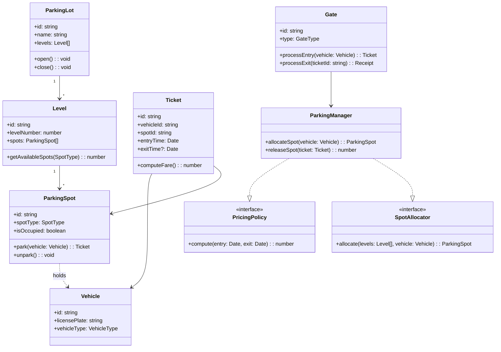

## Functional requirements (FR)

FR1 — Create/open/close a parking lot with N levels.

FR2 — Park a vehicle (issue ticket with spot assignment).

FR3 — Unpark a vehicle (close ticket, compute fee).

FR4 — Support vehicle types: Motorcycle, Car, Bus/Truck (different spot sizes).

FR5 — Query availability by level and by vehicle type.

FR6 — Support hourly/dynamic pricing policies.

FR7 — Support reservations (optional).

FR8 — Support multiple entry/exit gates.

FR9 — Generate basic reports (occupancy, revenue) per day.

## Non-functional requirements (NFR)

NFR1 — Response time: <200ms for park/unpark operations (on single region DB).

NFR2 — Accurate concurrency handling for spot assignment (no double-allocate).

NFR3 — Highly testable: clear interfaces, dependency injection.

NFR4 — Extensible: new vehicle types, pricing strategies, payment adapters.

NFR5 — Durable persistence for tickets and revenue.

## Core entities & responsibilities

ParkingLot — holds Levels, global config.

Level — contains ParkingSpots grouped by SpotType.

ParkingSpot — ID, type, occupancy state, location.

Vehicle — vehicle id, license plate, vehicle type.

Ticket — mapping vehicle -> spot, time in, time out, fare.

Gate (Entry/Exit) — handles park/unpark requests; interfaces with ParkingManager.

ParkingManager — orchestration service: assigns spots, issues tickets, calculates fees.

PricingPolicy (Strategy) — compute fare given duration / rules.

Reservation — optional booking for a future time slot.

SpotAllocator (Strategy/Factory) — allocation algorithm (nearest, random, reserved-first).

Repository interfaces — for Tickets, Spots, Vehicles (so persistence is pluggable).

## Relationships

ParkingLot ↔ Level (1..N)

Level ↔ ParkingSpot (1..M)

Ticket → ParkingSpot (1..1)

Ticket → Vehicle (1..1)

Gate → ParkingManager (calls)

ParkingManager uses PricingPolicy and SpotAllocator.

---

## UML class diagram (Mermaid)



---

## Design patterns used

Strategy — for PricingPolicy and SpotAllocator.

Factory — create Ticket/ParkingSpot objects.

Repository — abstract storage for tickets/spots (facilitates switching DB).

Singleton — ParkingManager per parking lot instance (or DI-managed).

Observer/Event — optional: notify listeners on occupancy changes.

## Concurrency & scaling

In single process: use locks at Level or Spot allocation (mutex).

In distributed deployment: use Redis distributed lock or DB transactions with SELECT FOR UPDATE/optimistic locking on spot rows.

For reservations / high concurrency: allocate with short TTL locks, confirm on payment.

## TypeScript skeleton (file structure)

```
/parking-lot
  /src
    /models
      ParkingLot.ts
      Level.ts
      ParkingSpot.ts
      Vehicle.ts
      Ticket.ts
      enums.ts
    /services
      ParkingManager.ts
      SpotAllocatorNearest.ts
      PricingPolicyHourly.ts
    /repositories
      SpotRepository.ts   // interface
      TicketRepository.ts // interface
      InMemorySpotRepo.ts
      InMemoryTicketRepo.ts
    /controllers
      GateController.ts
    index.ts
  package.json
  README.md

```